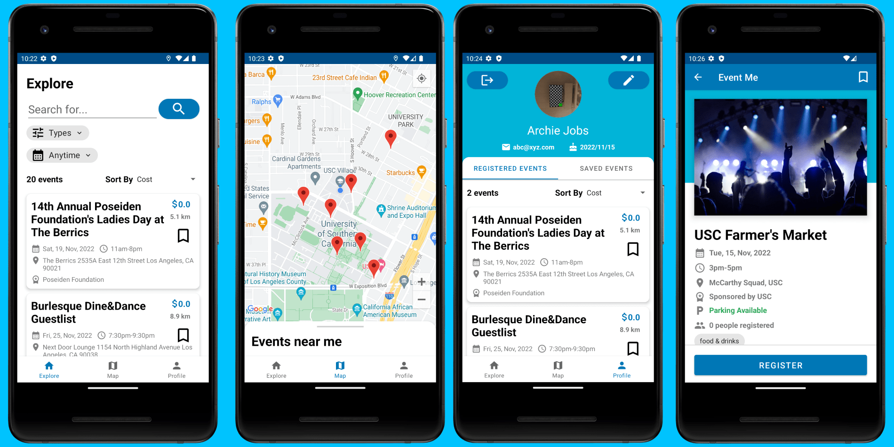

EventMe
==================

## Features
EventMe is a fully functional Android app built entirely on Java and Android Jetpack, with Firebase as the backend. It is an app that helps users explore local events and to register for them.
## Screenshots

## Build
### For both release and debug build
- Put Firebase `google-services.json` file under the app level root directory
- Put Google Map SDK API Key in `local.properties` as `MAPS_API_KEY=${Value}`
### For debug build only
- Install [Firebase CLI](https://firebase.google.com/docs/cli#install_the_firebase_cli) and run `firebase login`

## Run
### For both release and debug build
- Update Google Play Services to the latest version
- If using an emulator, set the its location to USC Village
### For debug build only
- Run `./run-firebase-emulator.sh` before running the debug build. This will use our pre-defined user and event data to locally test the app. We have one dummy user with email `abc@xyz.com` and password `123456`
